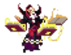

# Juego de Tower Defense

¡Bienvenido al juego de Tower Defense, donde el pensamiento estratégico y las decisiones rápidas son cruciales! Este juego está diseñado para 2 jugadores, Rojo y Azul️, cada uno defendiendo su torre correspondiente. Prepárate para una batalla épica mientras despliegas una variedad de monstruos para proteger tu torre y lanzar ataques a la fortaleza del oponente.

## Descripción del Juego

- **Jugadores:** Rojo y Azul.
- **Objetivo:** Defender tu torre mientras atacas la torre del enemigo.
- **Carriles:** Dos carriles: Oeste y Este.
- **Vidas:** Cada jugador comienza con 3 vidas.
- **Monstruos:** Los jugadores tienen una lista de monstruos para desplegar estratégicamente.

### Detalles del Juego

- **Basado en Rondas:** El juego avanza por rondas, cada una con una duración de 1.5 segundos 🕒.
- **Despliegue de Monstruos:** Los jugadores despliegan monstruos durante las rondas para ejecutar ataques.
- **Movimiento:** Los monstruos se mueven por los carriles, atacando o ingresando al castillo enemigo.
- **Variabilidad:** El orden de las rondas puede variar, afectando el resultado. Un jugador puede atacar dos veces consecutivamente.
- **Reglas del Carril:** Solo se permite un monstruo por jugador por carril.
- **Distancia del Castillo:** Cada carril tiene 3 celdas que separan los castillos.

### Mecánicas de Combate

- **Secuencias de Ataque:** Los monstruos atacan en secuencia, con resultados potencialmente diferentes.
- **Reducción de Vida:** Cuando un monstruo llega al castillo enemigo, el jugador opuesto pierde una vida ❤️.
- **Derrota del Jugador:** Un jugador pierde cuando su recuento de vidas llega a cero.
- **Confrontación de Monstruos:** Los monstruos de jugadores opuestos se enfrentan cuando comparten una celda. El combate se resuelve a través de ataques recíprocos.
- **Puntos de Salud:** Los monstruos tienen puntos de salud que disminuyen con cada ataque. Un monstruo es eliminado cuando su salud llega a cero.

___

## Historia del juego

Bienvenido a una experiencia única que fusiona la esencia de los tiempos actuales con un contexto 
antiguo, donde castillos y estandartes se entrelazan con la presencia de monstruos de eras 
pasadas. Este juego transporta a los jugadores a un mundo fascinante donde lo antiguo se 
mezcla con lo moderno, creando un escenario inmersivo lleno de misterio y maravilla.

### Roles

En el universo de nuestro juego, los roles desempeñan un papel crucial en la estrategia y la 
dinámica del juego. Describimos los roles a continuación:

* **Sword**: El rol de la Espada representa la 
esencia de la fuerza bruta y la habilidad con armas cuerpo a cuerpo. Los 
portadores de la Espada son expertos en combate cercano, destacando por su 
valentía y capacidad para enfrentar desafíos de manera directa.
* **Demon**: Los Demonios personifican el 
caos y la oscuridad. Con habilidades místicas y una conexión con el inframundo, 
los portadores de este rol desatan poderes tenebrosos en el campo de batalla, 
sembrando la confusión y el temor entre sus enemigos.
* **Psychic**: Los Psíquicos poseen habilidades 
mentales extraordinarias. Capaces de manipular mentes y energías psíquicas, este 
rol destaca por su astucia estratégica y la capacidad de influir en el 
comportamiento de los adversarios.
* **Fire**: Los portadores del elemento Fuego 
canalizan la ardiente furia de las llamas. Caracterizados por su poder destructivo,
los roles de Fuego infligen daño devastador a sus oponentes, convirtiendo el campo
de batalla en un espectáculo de caos y destrucción.
* **Cold**: El rol de Frío representa la 
frialdad y la astucia. Los personajes asociados con el Frío tienen la capacidad 
de congelar a sus enemigos, ralentizando y debilitando a aquellos que se cruzan en 
su camino.
* **Beast**: Los seres Bestiales encarnan la 
ferocidad y la agilidad. Con instintos salvajes y habilidades animales, los roles de
Bestia destacan por su velocidad y capacidad para emboscar a los oponentes.
* **Water**: Los portadores del elemento Agua son 
maestros de la fluidez y la adaptabilidad. Con la capacidad de manipular el agua, 
estos roles son versátiles en el campo de batalla, controlando el entorno y 
desafiando a sus enemigos.
* **Electric**: El rol Eléctrico irradia energía 
y velocidad. Con la capacidad de canalizar la electricidad, estos personajes 
sorprenden a sus adversarios con movimientos rápidos y descargas eléctricas 
poderosas.
* **Venom**: Los roles de Veneno destacan por su
astucia y capacidad para infligir efectos debilitantes a través de toxinas mortales.
Su táctica se centra en socavar la resistencia de sus oponentes a lo largo del tiempo.
* **Radiant**: La luz y la benevolencia caracterizan
a los roles Radiantes. Dotados de habilidades curativas y protectores, estos personajes
son fundamentales en la preservación del equipo, ofreciendo apoyo vital en el campo
de batalla.

A continuación, presentamos una visualización clara de cómo interactúan los roles entre sí, donde las
flechan parten de aquellos roles que son fuertes contra otros. Por ejemplo, el rol de Fire es fuerte 
contra el de Cold, mientras que el rol de Cold es fuerte contra el de Water.

### Personajes

Antes de profundizar en los detalles específicos de los roles, conozcamos a los héroes y villanos que dan vida a 
esta emocionante trama. Cada personaje aporta su propio conjunto de habilidades y personalidad única al juego.

A continuacion se presentan los personajes del juego:

* **AbyssWalker**: 
* **Archangel**:
* **Blaze**:
* **Blob**:
* **Cadabra**:
* **Cleric**:
* **CrowApostate**:
* **ElectroBOOM**:
* **EvilBeast**:
* **Golem**:
* **HolyKnight**:
* **IceBeast**:
* **Ninja**:
* **Siren**:
* **Spartan**:

<!-- 

  

-->

___

## Como jugar

___

## Como compilar

___
## Como ejecutar

___
## Autores

## Licencia

